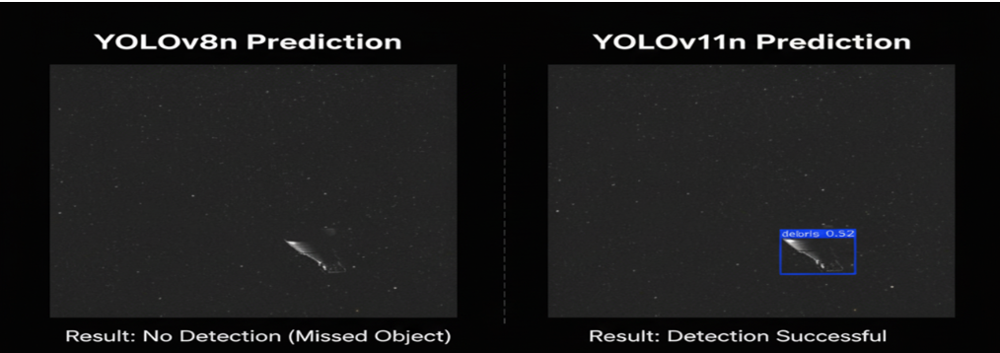
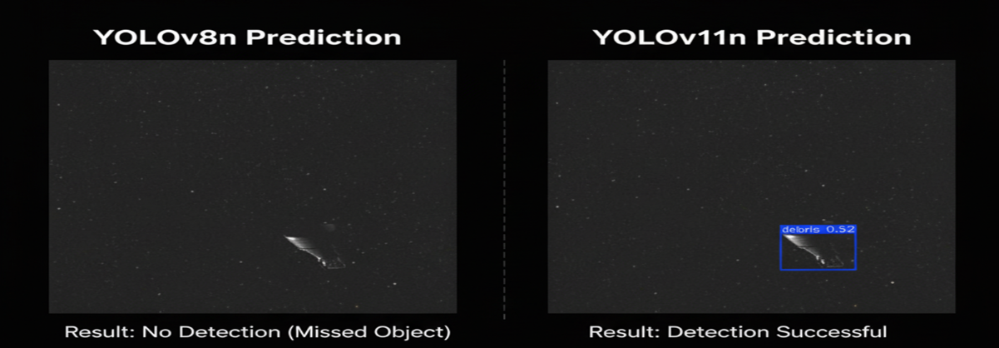

# space-hazard-detection-yolo
# YOLOv8 vs. YOLOv11: 우주 위험체 탐지 성능 비교 분석

### 1주차: 베이스라인 모델 선정 및 성능 비교
- **목표:** YOLOv8n과 YOLOv11n의 기본 성능을 비교하여 프로젝트의 베이스라인 모델 선정.
- **수행 내용:** 동일한 데이터셋과 학습 조건 하에 두 모델을 훈련하고, Test Set으로 최종 성능 평가 진행. (`evaluate_final.py`)
- **주요 결과:** YOLOv11n이 재현율(Recall)에서 0.727로 YOLOv8n(0.630) 대비 명백한 우위를 보임. 이는 '위험체 누락 방지'라는 핵심 목표에 더 부합함.
- **결정:** YOLOv11n을 2주차 개선 대상 모델로 최종 선정.



## 1. Abstract (초록)
본 프로젝트는 표준 객체 탐지 모델인 YOLOv8과 최신 연구 모델인 YOLOv11의 성능을 '우주 위험체 탐지'라는 특정 과업에 대해 비교 검증했습니다. 동일한 데이터셋과 학습 조건 하에서, YOLOv11이 더 높은 재현율(Recall)을 보여 '위험체 누락 방지'라는 핵심 목표에 더 부합함을 입증했습니다. 이 과정을 통해 최신 모델의 기술적 장단점을 실제 환경에서 비판적으로 분석하고, 프로젝트 목표에 따른 최적의 모델을 선정하는 전략적 의사결정 과정을 제시합니다.

## 2. Motivation (연구 동기)
증가하는 우주 위험체는 실제 운영 자산을 위협하는 심각한 문제입니다. 최신 모델인 YOLOv11의 성능 향상 주장이 실제 특정 도메인(우주 위험체)에서도 유효한지, 표준 모델인 YOLOv8과 공정하게 비교하여 검증할 필요가 있었습니다.

## 3. Hypothesis & Experiments (가설 및 실험 설계)
* **가설:** YOLOv11 논문에서 제안된 C2PSA 어텐션 메커니즘은 작은 객체 탐지 능력을 향상시켜, YOLOv8 대비 더 높은 재현율(Recall)을 보일 것이다.
* **실험 설계:** 가설 검증을 위해, 아래와 같이 모든 변수를 엄격하게 통제하여 두 모델의 순수한 성능 차이만을 측정했습니다.
    * **데이터셋:** 'debris' 단일 클래스 데이터셋으로 통일
    * **모델:** `YOLOv8n` vs `YOLOv11n` (동일 사이즈)
    * **학습 파라미터:** `Epochs: 50`, `Image Size: 640x640` 등 모든 조건 통일
    * **최종 평가:** 훈련/검증에 사용되지 않은 Test Set으로 최종 성능 측정

## 4. Results (결과)
### 4.1. 정량적 평가 (Quantitative Evaluation)
Test Set에 대한 최종 성능 비교 결과는 아래와 같습니다.

| 모델 (Model) | mAP@50 | mAP@50-95 | **Precision (정밀도)** | **Recall (재현율)** | **Inference Speed** |
| :--- | :--- | :--- | :--- | :--- |:--- |
| **YOLOv8n** | **0.784** | **0.471** | **1.0** | 0.630 | **4.4ms** |
| **YOLOv11n** | 0.734 | 0.462 | 0.881 | **0.727** | 5.4ms |

### 4.2. 정성적 평가 (Qualitative Evaluation)
**[사례 1: YOLOv11의 높은 재현율 (어텐션 메커니즘 효과)]**
*YOLOv8n이 놓친 작은 위험체를 YOLOv11n은 성공적으로 탐지했습니다.*


## 5. Conclusion (결론 및 향후 연구)
### 5.1. 결론
단순 mAP 점수와 속도는 YOLOv8n이 우세했으나, YOLOv11n은 최신 어텐션 기술을 통해 **'놓치지 않는 능력(재현율)'에서 명백한 기술적, 실용적 우위**를 보여주었습니다. '위험체 누락 방지'라는 프로젝트 목표에 따라, **YOLOv11n을 최종 베이스라인 모델로 선정**했습니다.

### 5.2. 향후 연구
선정된 YOLOv11n 모델의 약점(낮은 정밀도, '숨겨진 오탐')을 보완하고, 최종 목표인 11종 다중 클래스 모델로 확장하는 연구를 진행할 계획입니다.

## 6. 재현 가이드 (Reproducibility Guide)

### 1. 환경 설정 (Environment Setup)
```bash
# 1. Clone this repository
git clone [https://github.com/](https://github.com/)[ljh940620]/Space_Debris_Detection_Yolo.git
cd Space_Debris_Detection_Yolo

# 2. Create and activate conda environment
conda create -n space_torch python=3.9
conda activate space_torch

# 3. Install required libraries
pip install -r requirements.txt
```

### 2. 데이터셋 준비 (Dataset Preparation)
1.  [여기](https://www.kaggle.com/datasets/muhammadzakria2001/space-hazard-detection-dataset-for-yolov8)에서 11종 클래스 데이터셋을 다운로드 받아 `data` 폴더에 압축을 해제합니다.
2.  아래 스크립트를 실행하여 'debris' 단일 클래스 데이터셋을 생성합니다.
```bash
python src/data_preparation/prepare_debris_only_dataset.py
```

### 3. 모델 훈련 (Model Training)
```bash
# To train YOLOv8n model
python src\train\debris_only_run/train_yolo8_debris_only.py --model yolov8n.pt --name debris_yolov8_run

# To train YOLOv11n model
python src\train\debris_only_run/train_yolo11_debris_only.py --model yolov11n.pt --name debris_yolov11_run

### 4. 최종 평가 (Final Evaluation)
```bash
python src/evaluate/evaluate_final.py
```

---

### 2주차 진행 상황
### 초기 모델 성능 평가 완료
- **Base Model:** `YOLOv11n`
- **초기 평가 결과:**
  - 총 11개의 테스트 객체 중 8개를 탐지하며 준수한 성능을 보였습니다.
  - 하지만 일부 객체를 탐지하지 못하는 **낮은 재현율(Recall)** 문제와, 하나의 객체에 여러 개의 박스가 생성되는 **중복 탐지** 문제를 확인했습니다.

### 후처리 하이퍼파라미터 튜닝 실험
- **가설:** 초기 모델의 문제점은 후처리 파라미터(`Confidence Threshold`, `NMS IoU Threshold`) 조정으로 해결 가능할 것이다.
- **실험 내용:**
  1.  **Confidence Threshold 튜닝:** 재현율 개선을 위해 임계값 조정 (0.25 → 0.1)
  2.  **NMS IoU Threshold 튜닝:** 중복 탐지 문제 해결을 위해 임계값 조정 (0.7 → 0.5)
- **실험 결론:**
  - 파라미터 튜닝만으로는 근본적인 문제 해결에 명확한 한계가 있음을 확인했습니다.
  - 문제의 원인은 후처리 단계가 아닌, **모델 자체의 근본적인 탐지 능력 부족**으로 판단됩니다.

---

## 3. 실험 환경

- **Model:** `YOLOv11n`
- **Dataset:** Debris 단일 클래스 데이터셋 (Test Set: 123 Images, 11 instances)
- **학습 파라미터:**
  - **Epochs:** 50 (mAP 점수가 41 에폭에서 수렴)
  - **Image Size:** 640x640
- **개발 환경:**
  - `Ultralytics 8.3.189`
  - `Python 3.9.23`
  - `PyTorch 2.5.1`
  - `NVIDIA GeForce RTX 2080` (CUDA:0)

---

## 4. 향후 계획

- **모델 자체의 성능 강화:**
  - **Data Augmentation (데이터 증강):** 다양한 형태의 객체를 학습시켜 모델의 일반화 성능과 근본적인 탐지 능력을 높이는 재학습을 진행할 예정입니다.

---

### 3주차 진행상황
### YOLOv8 아키텍처 기반 나노(Nano) 모델 성능 비교 분석 (3주차 진행 보고)

---

## 1. 프로젝트 개요 (Problem Definition)**
- "서로 다른 YOLO 나노 모델은 동일한 우주 위험체 데이터셋에 대해 어떤 성능 차이를 보일까?"

- 본 문서는 '우주 위험체 탐지 프로젝트'의 3주차 진행 상황을 보고하고, 향후 프로젝트 제안서의 기반을 마련하기 위해 작성되었습니다.

- 우주 위험체 탐지의 중요성이 부각됨에 따라, 경량화된 딥러닝 모델의 성능을 정밀하게 비교 분석하는 것은 매우 중요합니다. 이번 3주차의 핵심 목표는 YOLOv8n 아키텍처를 기반으로 하는 두 개의 나노(nano) 모델(yolov11n 및 공식 yolov8n)을 동일하고 통제된 환경에서 훈련시키고, 특히 새롭게 추가된 'D2(우주 파편)' 클래스를 포함한 전체 데이터셋에 대해 각 모델이 어떤 강점과 약점을 보이는지 상세히 비교 분석하는 것입니다.

---

## 2. 사용된 기술 스택 (Tech Stack)

- **Language:** Python 3.9

- **Core Frameworks:** PyTorch 2.5 (CUDA 12.1), Ultralytics YOLOv8

- **Libraries:** OpenCV, NumPy, PyYAML, TQDM

---

## 3. 실험 환경 (Environment) (변경)
- **항목**
  - 운영체제:	Windows 11 Pro
  - 프로세서:	AMD Ryzen 5 5600G (6-Core, 12-Thread)
  - 메모리:	48.0 GB
  - GPU	NVIDIA GeForce RTX 4060 (VRAM 8GB)

---

## 4. 3주차 실험 내용 (Experiment Design)
- **가설:** "두 YOLO 나노 모델은 전체적인 성능은 유사할 수 있으나, 특정 클래스에 대한 정밀도(Precision)와 재현율(Recall)에서 유의미한 차이를 보일 것이다."

- **실험 과정:**
  1. 데이터셋 확장: 기존 위성/쓰레기 데이터셋에 'D2' (우주 파편) 클래스를 추가하여 총 12개 클래스로 데이터셋을 확장했습니다.

  2. 환경 구성: 두 YOLO 나노 모델의 성능을 공정하게 비교하기 위해, 동일한 하드웨어와 소프트웨어 환경을 구성했습니다.

  3. 모델별 훈련 및 평가: 이 통제된 환경에서 yolov11n과 공식 yolov8n 모델을 확장된 데이터셋과 동일한 하이퍼파라미터(epochs: 50, batch: 16 등)로 각각 훈련하고, test 데이터셋으로 최종 성능을 평가했습니다.

---

## 5. 중간 결과 분석 (Results & Analysis)
- 두 모델의 test 데이터셋 기준 중간 결과 비교는 다음과 같습니다.

- 주요 발견: 두 모델의 구조적 차이
  - 비교 분석 과정에서 두 모델이 실제 구조가 어떤 것이 다른지 확인했습니다. yolov8n 모델이 더 많은 파라미터와 연산량을 가집니다.

| 모델 | **yolov11n** | **yolov8n** |
| :--- | : --- | : --- |
| 레이어 수 |	100개	| 72개 |
| 파라미터 수 | 약 260만 개 |	약 300만 개 |
| 연산량 (GFLOPs) |	6.3	| 8.1 |

- **Test Set 기준 최종 성능 비교**
| 지표 (Metric) |	yolov11n | yolov8n |
| :--- | : --- | : --- |
| mAP@50 (일반 정확도) | 0.904 (90.4%) | **0.925 (92.5%)** |
| 정밀도 (Precision) | **0.907 (90.7%)** | 0.880 (88.0%) |
| 재현율 (Recall) |	0.817 (81.7%) |	**0.846 (84.6%)** |
|추론 속도 (FPS) |	~175 FPS | **~200 FPS** |

- 종합 분석: yolov8n 모델이 더 빠른 속도와 더 높은 **종합 정확도(mAP50)**를 보여주었습니다. 특히 가장 탐지하기 어려웠던 **smart_1 클래스에 대한 성능이 압도적으로 우수하여(mAP50: 99.5%)**, 모델의 안정성과 잠재력이 더 높음을 입증했습니다. 반면, yolov11n 모델은 **더 높은 정밀도(Precision)**를 기록하여 오탐지가 적은 특성을 보였습니다.

- 성능 특성:

  1. yolov11n은 **정밀도(Precision)**가 더 높아, 예측한 결과의 신뢰도(오탐지가 적음)가 중요한 경우 더 적합합니다.

  2. yolov8n은 **재현율(Recall)**이 약간 더 높아, 객체를 하나라도 놓치지 않는 것이 중요한 경우 더 적합할 수 있습니다.

  3. **신규 클래스('D2') 탐지 성능**: 두 모델 모두 새롭게 추가된 'D2' 클래스에 대해서는 99% 이상의 mAP50 점수를 기록하며 매우 성공적으로 학습했음을 확인했습니다.

---

## 6. 결론 (3주차)
프로젝트 3주차까지의 연구를 통해, 두 YOLO 나노 모델이 확장된 데이터셋에 대해 전반적으로 우수한 성능을 보이지만, 정밀도와 재현율 측면에서 뚜렷한 성향 차이를 나타냄을 성공적으로 입증했습니다.

**'오탐지를 최소화'** 하는 것이 중요하다면 YOLOv11n을,

**'미탐지를 최소화'** 하고 전반적인 균형을 원한다면 YOLOv8n을 선택하는 것이 합리적입니다.

이러한 분석 결과는 특정 목적에 맞는 최적 모델을 선택하는 데 중요한 근거 자료를 제공합니다.

---


